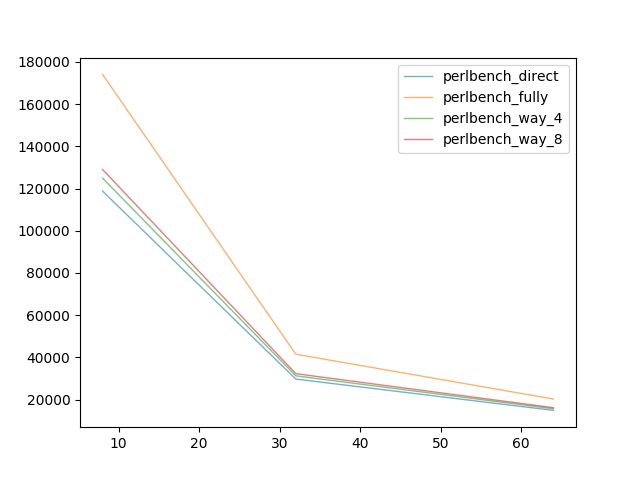
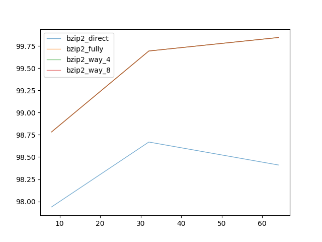

## Cache Analysis

> 计75班 赵成钢 2017011362

### 源代码说明

源代码放置在了 `code/` 目录中，在目录中包含一个 Makefile，输入 `make` 可以编译，`make run` 可以编译同时运行。需要注意的是在运行前，需要保证 `log` 和`trace`的文件夹的存在，而且`trace`目录中包括几个重要的 trace 文件。

代码的运行会根据实验要求，会像下面展示的一样将实验中全部要求运算并输出日志，把结果写入到`output.csv`文件中。

```c++
const char* name[4] = {"astar", "bzip2", "mcf", "perlbench"};
const char* path[4] = {"trace/astar.trace", "trace/bzip2.trace", "trace/mcf.trace", "trace/perlbench.trace"};

// For answering the problems
void experiment_1(const char *csv) {
    printf("Running experiment 1 ...\n");
    for (int i = 0; i < 4; ++ i)
        for (auto layout: {DIRECT, FULLY, WAY_4, WAY_8})
            for (auto block_size: {8, 32, 64})
                testcase(name[i], path[i], csv, layout,
                    ReplaceType::LRU, WriteAllocateType::WRITE_ALLOCATE,
                    WritePolicyType::WRITE_BACK, 131072, block_size);
}

...
```

#### 输出结果

输出日志参见 `code/log/` 中，实验中的命中率等源数据见`code/output.csv`。

画图脚本见`code/draw.py`，图输出在`code/figures/`中。

### 实现细节

#### Bitmap

为了进一步减少源数据的开销，我仿照`std::bitset`实现了一个动态申请内存的`Bitmap`，可以指定一个宽度为 $count$ 的数组，数组每个元素有 $unit\_bits$ 个位，这个封装会把正好申请 $count*unit\_bits/8$ 个字节，并通过位运算来实现访问和修改，具体实现可以参考`utility.hpp`文件。

为什么要这样做呢？

- 可以避免后面大量编程上的重复复杂的位运算；
- 多个元素直接可以合并为一个字节，位基本控制，严格的空间大小；
- 在硬件上也有类似的包装，在计算机组成原理课程中，我们可以通过声明 `xpm_memory_sprom` 等类似的 Xilinx 封装好的 Block RAM 实现，同样可以设置单个元素的位大小和整体大小，这样做也有一定的一致性。

#### Cache64

实现上全部用参数化设计，不同的 Cache 布局将同样视为多路的实现。替换算法将作为一个抽象类子对象 `replace` 被调用，写策略作为 Cache 的属性，在查找中作为逻辑分支判断使用。具体参考 `cache.hpp`。

#### CacheReplace

为了更好的体现替换行为在逻辑上的一致性，我用了一个 `CacheReplace` 类来抽象替换的行为，包括查找 victim 和命中的行为。随机替换、LRU 和 TreeLRU 算法将全部继承这个抽象类。具体实现参考 `replace.hpp`。

### 实验结果部分

#### 固定替换策略（LRU）；固定写策略（写分配+写回）；尝试不同布局

**元数据开销情况**

在不同的测例下，元数据开销是相同的，具体不同布局关于块大小的变化如图：



可以看到随着块大小的增大，对应的元数据开销也越来越小，因为元数据维护在块上。同时注意到路数越多（直接相联可视为 1 路，全相联可以视为全路），开销也越大，这部分的增加是因为 LRU 需要维护每路信息也就越多，具体共需要 $O(ways*block\_count*log_2(ways))$ 个位；同时，也因为 TAG 位变多，布局所需要的元数据也变大 $O(bits\_tag*block\_count)$；写策略具体不会产生影响。

具体的数据如下（元数据大小单位为字节）：

| 类型   | 块大小 | 总元数据 | 布局元数据 | 替换策略元数据 | 写策略元数据 |
| ------ | ------ | -------- | ---------- | -------------- | ------------ |
| DIRECT | 8      | 118784   | 100352     | 2048           | 16384        |
| DIRECT | 32     | 29696    | 25088      | 512            | 4096         |
| DIRECT | 64     | 14848    | 12544      | 256            | 2048         |
| FULLY  | 8      | 174080   | 129024     | 28672          | 16384        |
| FULLY  | 32     | 41472    | 31232      | 6144           | 4096         |
| FULLY  | 64     | 20224    | 15360      | 2816           | 2048         |
| WAY_4  | 8      | 124928   | 104448     | 4096           | 16384        |
| WAY_4  | 32     | 31232    | 26112      | 1024           | 4096         |
| WAY_4  | 64     | 15616    | 13056      | 512            | 2048         |
| WAY_8  | 8      | 129024   | 106496     | 6144           | 16384        |
| WAY_8  | 32     | 32256    | 26624      | 1536           | 4096         |
| WAY_8  | 64     | 16128    | 13312      | 768            | 2048         |

**命中率情况**

首先下面是几个关键测例的命中率随块大小变化的情况（曲线可能有重合）：





可以观察到几个特点：

- 整体上块大小越大，命中率越大（除了 bzip2 测例中的直接映射），我认为的原因是程序的空间局部性是在一段相对块大小更大的连续内存区域上体现的，更大的块意味着次数取数据的次数更少；同时也因为 index 位会减少，tag 位更多，在一个组中替换更加灵活；
- 路数越多命中率越大，因为 index 位减少，在一个组内有更多可能性存更多有用的数据，如果是直接映射就会有很大的概率的换入换出的情况。
- 测例上来说，astar 因为是图访问，可能更为随机，命中率也更低，而且不同布局的表现类似；bzip2 测例是因为连续的数据读取并压缩，命中率更高，不同布局表现类似，路数越多也就越吃香；mcf 测例我不太了解具体应用场景，不过在结果上和 bzip2 类似，命中率相对高；perlbench 测例更像是一个比较综合场景的测例，命中率相对高，但是对不同的布局的区分度也好些。

附具体数据如下：

| **测例**      | **类型** | **块大小** | **命中** | **缺失** | **命中率** |
| ------------- | -------- | ---------- | -------- | -------- | ---------- |
| **astar**     | DIRECT   | 8          | 384144   | 117324   | 76.60389   |
| **astar**     | DIRECT   | 32         | 452135   | 49333    | 90.16228   |
| **astar**     | DIRECT   | 64         | 475050   | 26418    | 94.73187   |
| **astar**     | FULLY    | 8          | 384828   | 116640   | 76.74029   |
| **astar**     | FULLY    | 32         | 453357   | 48111    | 90.40597   |
| **astar**     | FULLY    | 64         | 476560   | 24908    | 95.03298   |
| **astar**     | WAY_4    | 8          | 384731   | 116737   | 76.72095   |
| **astar**     | WAY_4    | 32         | 453177   | 48291    | 90.37007   |
| **astar**     | WAY_4    | 64         | 476345   | 25123    | 94.99011   |
| **astar**     | WAY_8    | 8          | 384702   | 116766   | 76.71516   |
| **astar**     | WAY_8    | 32         | 453189   | 48279    | 90.37247   |
| **astar**     | WAY_8    | 64         | 476394   | 25074    | 94.99988   |
| **bzip2**     | DIRECT   | 8          | 533289   | 11225    | 97.93853   |
| **bzip2**     | DIRECT   | 32         | 537266   | 7248     | 98.66890   |
| **bzip2**     | DIRECT   | 64         | 535858   | 8656     | 98.41033   |
| **bzip2**     | FULLY    | 8          | 537887   | 6627     | 98.78295   |
| **bzip2**     | FULLY    | 32         | 542846   | 1668     | 99.69367   |
| **bzip2**     | FULLY    | 64         | 543673   | 841      | 99.84555   |
| **bzip2**     | WAY_4    | 8          | 537887   | 6627     | 98.78295   |
| **bzip2**     | WAY_4    | 32         | 542846   | 1668     | 99.69367   |
| **bzip2**     | WAY_4    | 64         | 543673   | 841      | 99.84555   |
| **bzip2**     | WAY_8    | 8          | 537887   | 6627     | 98.78295   |
| **bzip2**     | WAY_8    | 32         | 542846   | 1668     | 99.69367   |
| **bzip2**     | WAY_8    | 64         | 543673   | 841      | 99.84555   |
| **mcf**       | DIRECT   | 8          | 482596   | 25104    | 95.05535   |
| **mcf**       | DIRECT   | 32         | 496547   | 11153    | 97.80323   |
| **mcf**       | DIRECT   | 64         | 500290   | 7410     | 98.54048   |
| **mcf**       | FULLY    | 8          | 484468   | 23232    | 95.42407   |
| **mcf**       | FULLY    | 32         | 498437   | 9263     | 98.17550   |
| **mcf**       | FULLY    | 64         | 502198   | 5502     | 98.91629   |
| **mcf**       | WAY_4    | 8          | 484468   | 23232    | 95.42407   |
| **mcf**       | WAY_4    | 32         | 498437   | 9263     | 98.17550   |
| **mcf**       | WAY_4    | 64         | 502198   | 5502     | 98.91629   |
| **mcf**       | WAY_8    | 8          | 484468   | 23232    | 95.42407   |
| **mcf**       | WAY_8    | 32         | 498437   | 9263     | 98.17550   |
| **mcf**       | WAY_8    | 64         | 502198   | 5502     | 98.91629   |
| **perlbench** | DIRECT   | 8          | 488834   | 18607    | 96.33317   |
| **perlbench** | DIRECT   | 32         | 495700   | 11741    | 97.68623   |
| **perlbench** | DIRECT   | 64         | 497830   | 9611     | 98.10599   |
| **perlbench** | FULLY    | 8          | 498540   | 8901     | 98.24590   |
| **perlbench** | FULLY    | 32         | 504091   | 3350     | 99.33982   |
| **perlbench** | FULLY    | 64         | 505475   | 1966     | 99.61257   |
| **perlbench** | WAY_4    | 8          | 496931   | 10510    | 97.92882   |
| **perlbench** | WAY_4    | 32         | 501678   | 5763     | 98.86430   |
| **perlbench** | WAY_4    | 64         | 503112   | 4329     | 99.14690   |
| **perlbench** | WAY_8    | 8          | 498357   | 9084     | 98.20984   |
| **perlbench** | WAY_8    | 32         | 503269   | 4172     | 99.17784   |
| **perlbench** | WAY_8    | 64         | 504272   | 3169     | 99.37549   |

#### 固定布局（块大小8字节，8路组相联）；固定写策略（写分配+写回）；尝试不同替换策略

**元数据开销情况**

具体数据如下表：

| 替换策略 | 总元数据 | 布局元数据 | 替换元数据 | 写策略元数据 |
| -------- | -------- | ---------- | ---------- | ------------ |
| RANDOM   | 122880   | 106496     | 0          | 16384        |
| LRU      | 129024   | 106496     | 6144       | 16384        |
| TREELRU  | 124928   | 106496     | 2048       | 16384        |

可以看到三种策略元数据开销：

- 随机替换为 0；
- LRU 最大，具体为 $O(ways*block\_count*log_2(ways)) $ 个位；
- TreeLRU 相对 LRU 更小 $O(ways*block\_count)$ 个位；
- LRU 比 TreeLRU 多乘了一个 $log_2(ways)$。

**执行动作差异**

在命中时：

- 随机替换无动作发生；
- LRU 会把命中的路放到栈顶；
- TreeLRU 会把树根到命中的一路的节点上的值都改成对应的路的方向。

在查找 victim 时并加入新的时：

- 随机替换将随机返回组中的一路；
- LRU 会返回栈底，把新的放到栈顶（其实就是把栈底移到栈顶，数据不同，但是路数一样）；
- TreeLRU 会找到”最旧“的一个返回，并执行命中时方向的修改。

**对命中率影响**

经测试，命中率数据如下：

| 测例          | 替换策略 | 命中   | 缺失   | 命中率   |
| ------------- | -------- | ------ | ------ | -------- |
| **astar**     | RANDOM   | 385001 | 116467 | 76.77479 |
| **astar**     | LRU      | 384702 | 116766 | 76.71516 |
| **astar**     | TREELRU  | 384880 | 116588 | 76.75066 |
| **bzip2**     | RANDOM   | 537887 | 6627   | 98.78295 |
| **bzip2**     | LRU      | 537887 | 6627   | 98.78295 |
| **bzip2**     | TREELRU  | 537887 | 6627   | 98.78295 |
| **mcf**       | RANDOM   | 484379 | 23321  | 95.40654 |
| **mcf**       | LRU      | 484468 | 23232  | 95.42407 |
| **mcf**       | TREELRU  | 484468 | 23232  | 95.42407 |
| **perlbench** | RANDOM   | 498356 | 9085   | 98.20964 |
| **perlbench** | LRU      | 498357 | 9084   | 98.20984 |
| **perlbench** | TREELRU  | 498367 | 9074   | 98.21181 |

可以看到：

- 三种策略的差异非常小，命中率的个位数字几乎相同，也无法得出相对谁更好的结论，也可能是因为在 8 路的情况下，缩小了策略带来的差异，因为路数更多，需要替换的情况也就更少了；
- 然而经过试验，发现在 4 路的情况下，它们的差异也非常小，这里我的想法是 4 路的时候替换的确定性更大（其实也是强行解释），所以这里我的结论是程序在执行的时候不会按照 Cache 替换的设计来，执行的模式并非经常会访问”前不久“之前的数据（比如顺序访问、图的随机访问），所以 Cache 替换策略更体现在小数点后；
- 针对不同测例，astar 因为是图访问，所以更久不一定意味着不访问，这时候随机会稍好一些（非常不明显）；bzip2 估计是不会再次读取访问过的数据，所以没有差别；而 mcf 和 perlbench 可能更偏向综合一些，也有一定的时间局部性，所以这时候 LRU 和 TreeLRU 的表现稍好一些（也不明显）。

#### 固定布局（块大小8字节，8路组相联）；固定替换策略（LRU）；尝试不同写策略

**元数据开销情况**

具体数据如下表：

| 写分配策略         | 写回策略      | 总元数据 | 布局元数据 | 替换元数据 | 写策略元数据 |
| ------------------ | ------------- | -------- | ---------- | ---------- | ------------ |
| WRITE_ALLOCATE     | WRITE_BACK    | 129024   | 106496     | 6144       | 16384        |
| WRITE_ALLOCATE     | WRITE_THROUGH | 110592   | 104448     | 6144       | 0            |
| WRITE_NOT_ALLOCATE | WRITE_BACK    | 129024   | 106496     | 6144       | 16384        |
| WRITE_NOT_ALLOCATE | WRITE_THROUGH | 110592   | 104448     | 6144       | 0            |

可以得到结论，唯一对元数据开销的影响就是 Dirty 位有没有：

- 如果写回策略是写回，则需要增加块数个二进制位；
- 如果是写直达，则不需要 Dirty 位，开销为零。

**对命中率影响**

经测试，命中率数据如下：

| 测例          | 写分配策略         | 写回策略      | 命中   | 缺失   | 命中率   |
| ------------- | ------------------ | ------------- | ------ | ------ | -------- |
| **astar**     | WRITE_ALLOCATE     | WRITE_BACK    | 384702 | 116766 | 76.71516 |
| **astar**     | WRITE_ALLOCATE     | WRITE_THROUGH | 384702 | 116766 | 76.71516 |
| **astar**     | WRITE_NOT_ALLOCATE | WRITE_BACK    | 328467 | 173001 | 65.50109 |
| **astar**     | WRITE_NOT_ALLOCATE | WRITE_THROUGH | 328467 | 173001 | 65.50109 |
| **bzip2**     | WRITE_ALLOCATE     | WRITE_BACK    | 537887 | 6627   | 98.78295 |
| **bzip2**     | WRITE_ALLOCATE     | WRITE_THROUGH | 537887 | 6627   | 98.78295 |
| **bzip2**     | WRITE_NOT_ALLOCATE | WRITE_BACK    | 497305 | 47209  | 91.33007 |
| **bzip2**     | WRITE_NOT_ALLOCATE | WRITE_THROUGH | 497305 | 47209  | 91.33007 |
| **mcf**       | WRITE_ALLOCATE     | WRITE_BACK    | 484468 | 23232  | 95.42407 |
| **mcf**       | WRITE_ALLOCATE     | WRITE_THROUGH | 484468 | 23232  | 95.42407 |
| **mcf**       | WRITE_NOT_ALLOCATE | WRITE_BACK    | 451107 | 56593  | 88.85306 |
| **mcf**       | WRITE_NOT_ALLOCATE | WRITE_THROUGH | 451107 | 56593  | 88.85306 |
| **perlbench** | WRITE_ALLOCATE     | WRITE_BACK    | 498357 | 9084   | 98.20984 |
| **perlbench** | WRITE_ALLOCATE     | WRITE_THROUGH | 498357 | 9084   | 98.20984 |
| **perlbench** | WRITE_NOT_ALLOCATE | WRITE_BACK    | 483777 | 23664  | 95.33660 |
| **perlbench** | WRITE_NOT_ALLOCATE | WRITE_THROUGH | 483777 | 23664  | 95.33660 |

结论：

- 首先，写回策略不会对命中率产生任何影响，区别只是空间开销和执行行为（一个在第二次写回、一个直接写回）；
- 其次，写分配策略非常重要，对最后结果影响也非常大，可以得到结论，程序在写入某个位置之后有比较明显的概率再次读取；
- 针对不同测例，astar 算法因为是图访问模式，在搜索更新后，非常容易再次用到，所以写分配测例非常重要，影响也很大；而剩下三种，可能顺序访问内存的情况更多，影响相对较小，但也同样不可以忽略，可见在实际的设计中采用写分配的策略还是非常重要的。